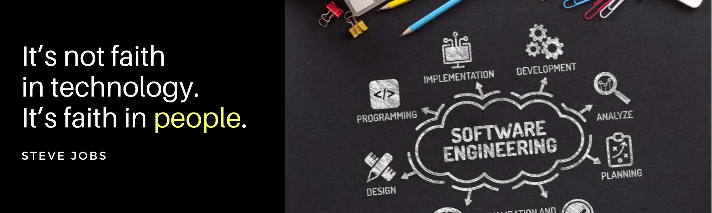

<!--  -->

<h1 align="center">Hi , I'm Mirzamurod</h1>
<h3 align="center">I'm a Software Engineer from Uzbekistan.</h3>

<!-- 
A 22Y/O Software🌈 and Web developer🎯 from India. I'm passionate about Full-Stack Web Development.:bar_chart:. I like automating things, building pipelines, exploring scalability problems and improving efficiency and performance. Strong Advocate for 📜 open source, :cloud: Cloud computing, 🚀 DevOps, :new: Innovation and Automation :robot:

 -->

<!--
**Mirzamurod/Mirzamurod** is a ✨ _special_ ✨ repository because its `README.md` (this file) appears on your GitHub profile.

Here are some ideas to get you started: -->

## 🙋‍♂️ About Me

- 🔭 I’m currently working on [PcStore](https://github.com/Mirzamurod/PcStore)
- 🌱 I’m currently learning [NextJs](https://nextjs.org) and [Typescript](https://www.typescriptlang.org)
<!-- - 👯 I’m looking to collaborate on ... -->
<!-- - 🤔 I’m looking for help with ... -->
- 💬 Ask me about React
- 📫 How to reach me: rahimberdiyevmirzamurod@gmail.com
- 👨‍💻 All of my projects are available at [Mirzamurod](https://mirzamurod.netlify.app)
- 😄 Pronouns: he/him/his
<!-- - 📄 Know about my experiences -->
<!-- - ⚡ Fun fact: ... -->

## 👨‍💻 Programming Languages and Frameworks:

    
    
    
    
    
    
    
    
    
    
    

## 🗄 Databases and Cloud Hosting:

    
    
    

## 🖥 Software and Tools:

    
    
    
    
    
    

## 📊 My Github Stats

<b>Note:</b> Top languages is only a metric of the languages my public code consists of and doesn't reflect experience or skill level.
<!-- 
 -->

    

## 📬 Connect with me:
<!-- ## 🔗 Connect with me: -->

    
    
    
    
    

## ❤️ Views and Followers

